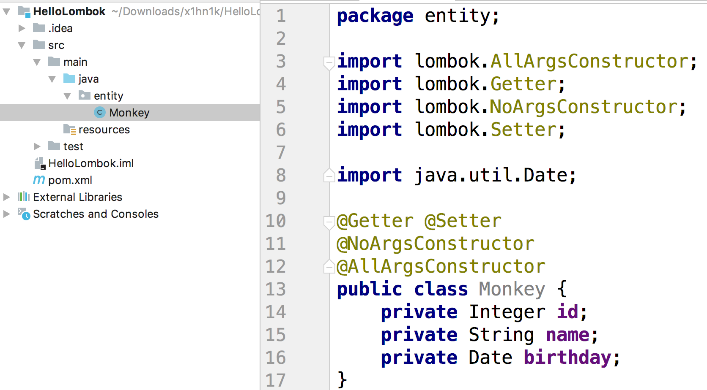
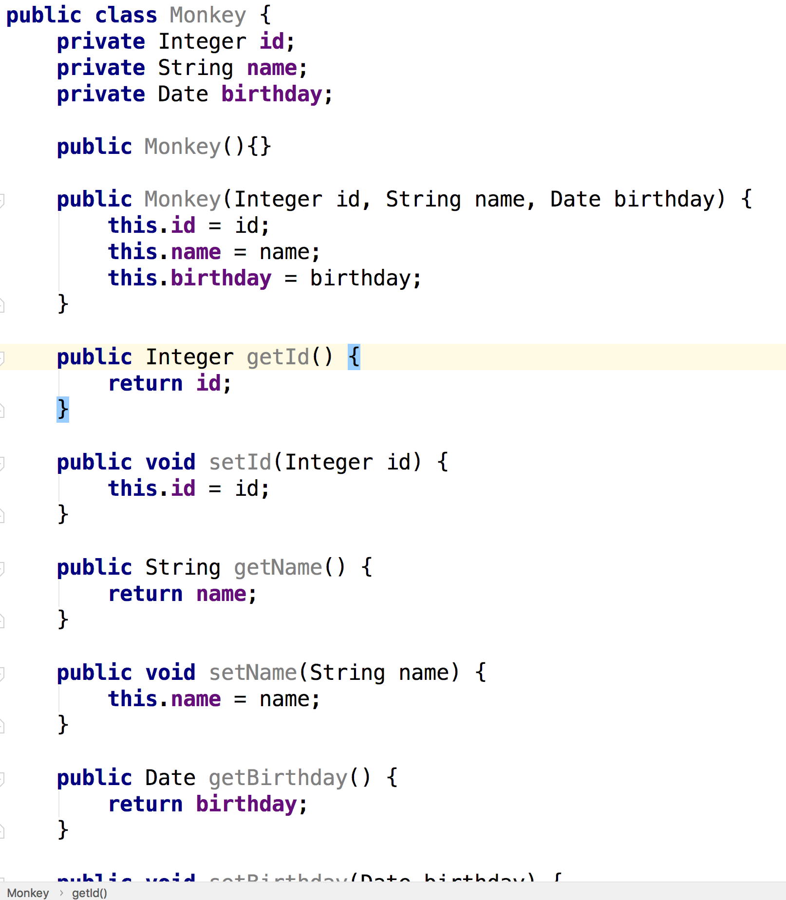
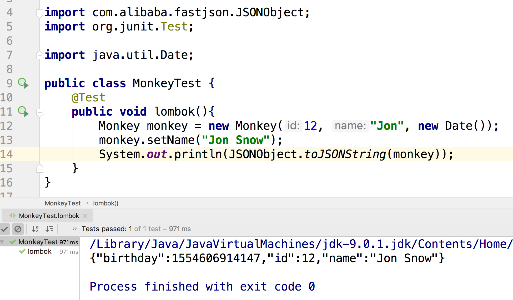

# HelloLombok

- <https://www.baeldung.com/intro-to-project-lombok>

#### 什么是lombok？

一个Java模块，可以帮助你通过注解的方式生成Getter Setter 子类的样板代码。

这是lombok的简单示例，添加上注解后这个实体类自动拥有了Getter Setter方法：




#### 为什么使用lombok

我们来看下传统的写法：



瞧，我都没办法完全截图

- 繁琐。即使是使用IDE自动生成，也是挺麻烦的。
- 不美观，那么多样板代码，看着真难受
- 难以修改。加入你要修改一些字段，那么你要花很多时间来修改其他的


#### 怎么用？

1. 添加maven依赖

   ```xml
           <dependency>
               <groupId>org.projectlombok</groupId>
               <artifactId>lombok</artifactId>
               <version>1.16.16</version>
           </dependency>
   ```

   

2. 使用注解标注实体类

   这个前面已经演示了


然后来测试下能不能用：



果然可以正常用。


#### 原理是什么？

<https://stackoverflow.com/questions/6107197/how-does-lombok-work>


#### 最佳实践是什么？

#### 常见的问题

